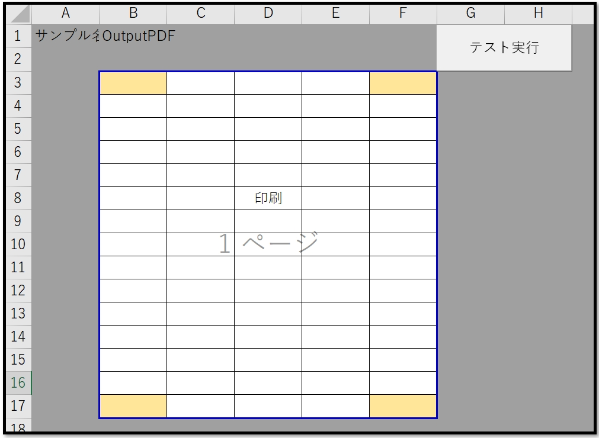
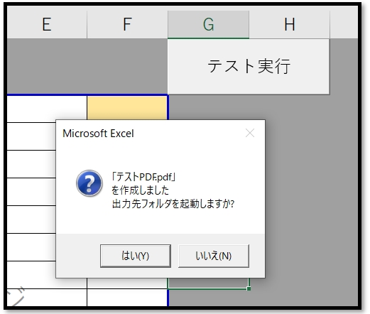
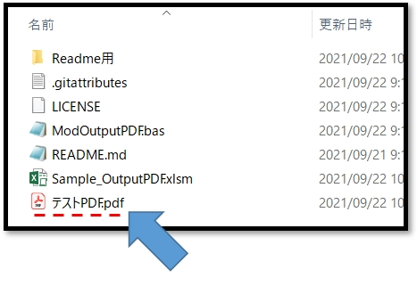
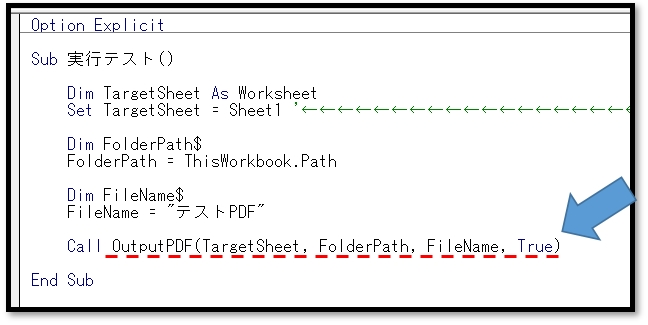

# VBA-OutputPDF
- License: The MIT license

- Copyright (c) 2021 YujiFukami

- 開発テスト環境 Excel: Microsoft® Excel® 2019 32bit 

- 開発テスト環境 OS: Windows 10 Pro

実行環境など報告していただくと感謝感激雨霰。

# 説明
特定シートの印刷範囲をPDFファイルとして出力する

## 活用例
PDF化をサポートする

# 使い方
実行サンプル「Sample-OutputPDF.xlsm」の中の使い方は以下の通り。

サンプル中身

印刷範囲が指定された状態のシート

「テスト実行」ボタンを押した後

確認メッセージが表示される。

メッセージで「はい」を押すと、出力されたPDFファイルがあるフォルダが起動する。

プロシージャ中身

プロシージャ「OutputPDF」が使われている。

引数は

-  TargetSheet PDF化する対象のシート（シートオブジェクト）

-  [FolderPath]  PDFファイルの出力先のフォルダパス(String型) デフォルトは自ブックのフォルダパス

-  [FileName]　PDFファイルのファイル名(String型) デフォルトはシート名

-  [MessageIrunaraTrue]  メッセージを表示するか否か(Boolean型) デフォルトはTrue

## 設定
実行サンプル「Sample-OutputPDF.xlsm」の中の設定は以下の通り。

### 設定1（使用モジュール）

-  ModTest.bas
-  ModOutputPDF.bas

### 設定2（参照ライブラリ）
なし

